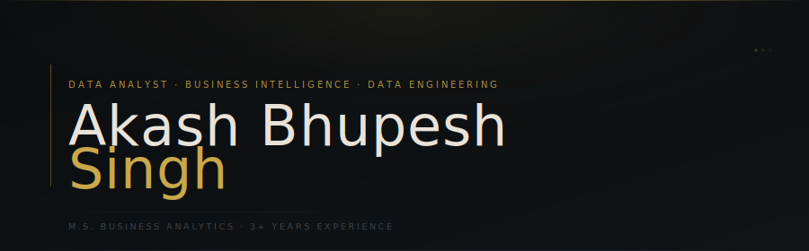

<div align="center">



<br/>

[](mailto:singh0811akash@gmail.com)
&nbsp;
[](https://linkedin.com/in/YOUR_HANDLE)
&nbsp;
[](https://github.com/YOUR_USERNAME)

</div>

<br/>

---

<br/>

I transform raw, unstructured data into structured, validated, and decision-ready insights — building the pipelines, models, and dashboards that make it possible.

My work sits at the intersection of **engineering** and **analysis**: I care as much about how data flows as what it says.

<br/>

---

<br/>

### ◆ &nbsp; Technical Stack

<br/>

**Languages & Querying**

`SQL` &nbsp; `BigQuery` &nbsp; `PostgreSQL` &nbsp; `SQL Server` &nbsp; `Python` &nbsp; `Pandas` &nbsp; `NumPy` &nbsp; `Matplotlib` &nbsp; `Advanced Excel`

**Data Engineering**

`ETL / ELT Pipelines` &nbsp; `Star Schema Modeling` &nbsp; `Data Warehousing` &nbsp; `API Integration` &nbsp; `Data Validation & Governance`

**Business Intelligence**

`Power BI` &nbsp; `Tableau` &nbsp; `Looker`

**Cloud Platforms**

`Google Cloud Platform` &nbsp; `Microsoft Azure` &nbsp; `AWS`

<br/>

---

<br/>

### ◆ &nbsp; Current Focus

<br/>

```
  01 / ETL          →   Production-ready pipelines with validation & observability
  02 / ARCHITECTURE →   Scalable warehouse design using dimensional modeling
  03 / END-TO-END   →   Analytics projects from ingestion to dashboard
  04 / FINANCE      →   Applying BI to asset management and financial datasets
```

<br/>

---

<br/>

### ◆ &nbsp; GitHub Activity

<br/>

<div align="center">


&nbsp;&nbsp;


</div>

<br/>

---

<br/>

<div align="center">

*"Data only has value when it drives decisions."*

<br/>

[](mailto:singh0811akash@gmail.com)

</div>
